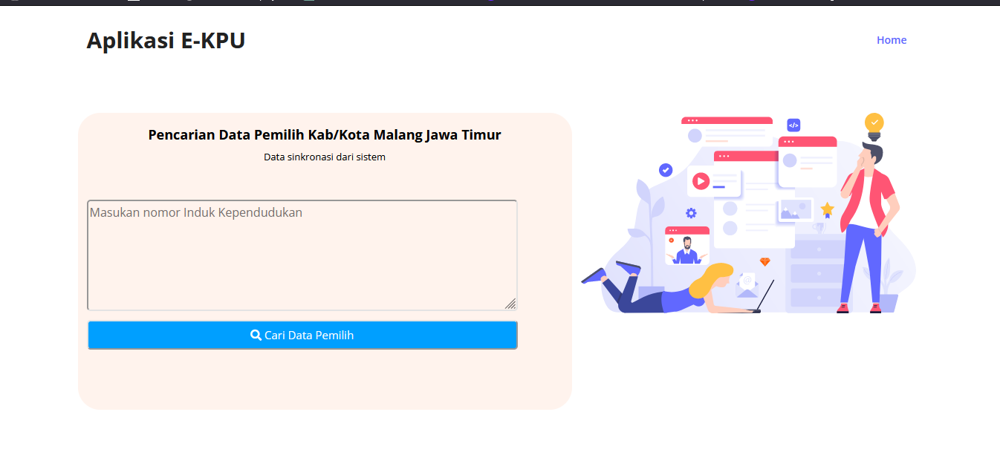
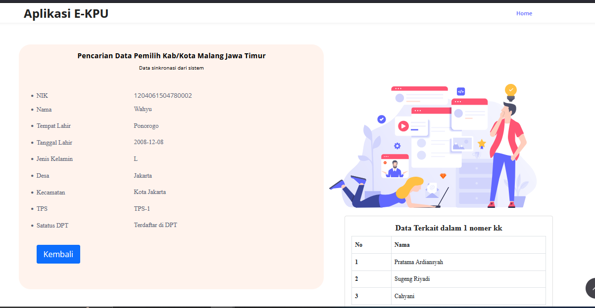
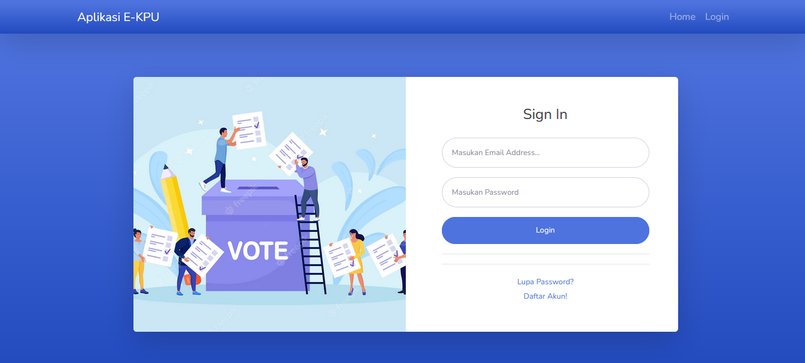
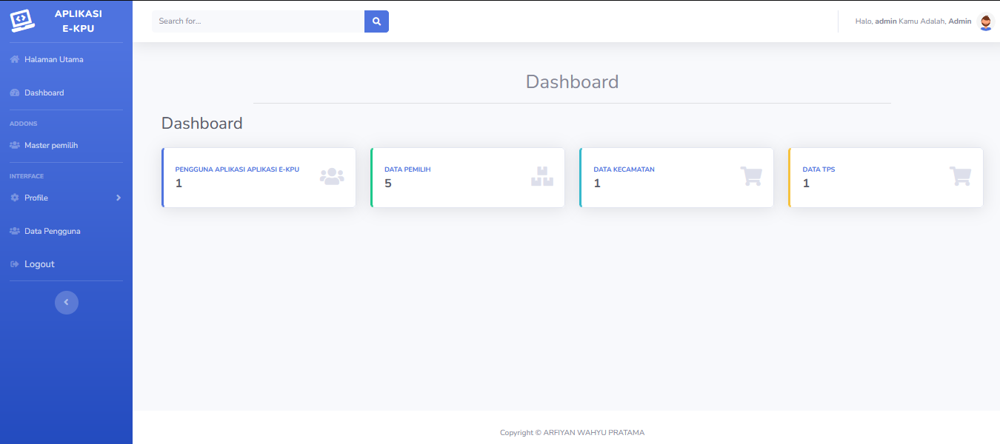
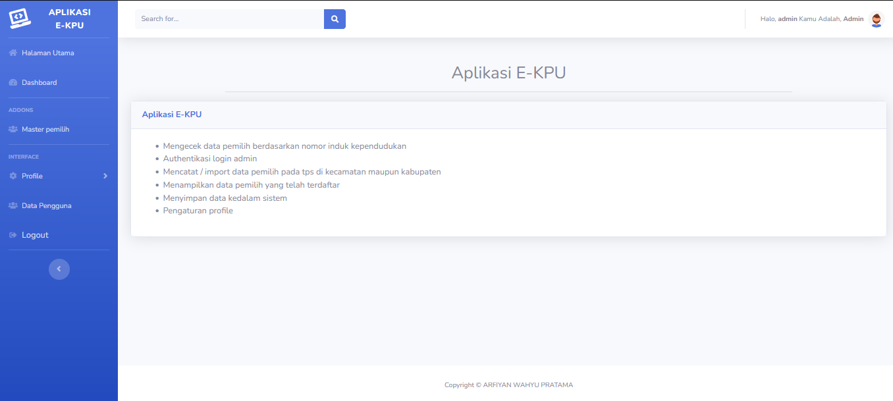
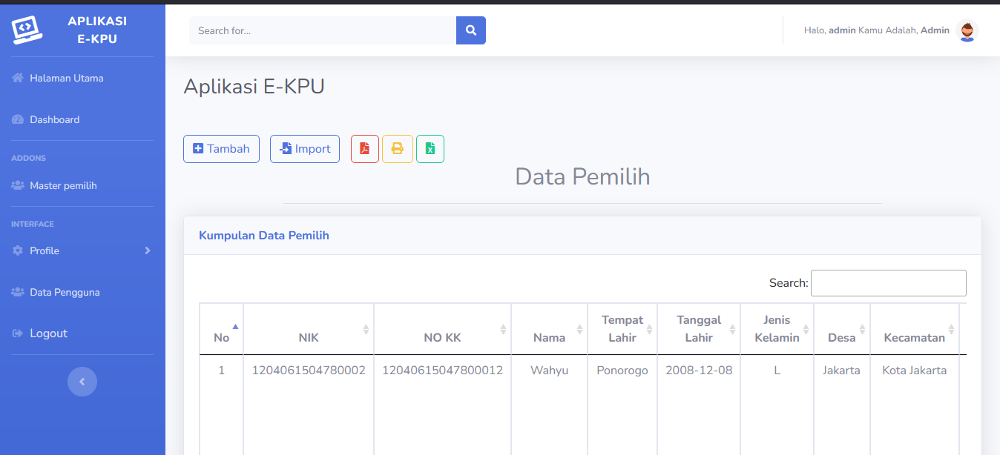
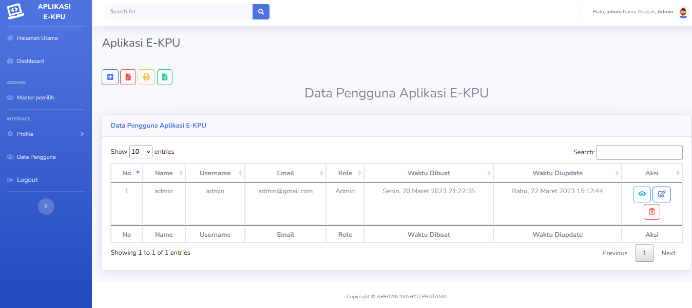
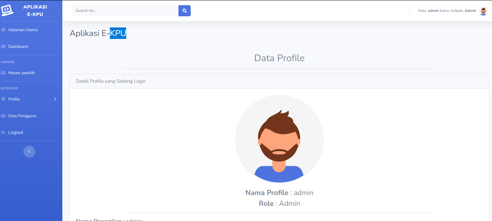

Nama : ARFIYAN

aplikasi kasir sederhana yang mencakup fitur:

1. Pencarian data pemilih
2. Menampilkan daftar data pemilih
3. Authentikasi login pengguna
4. Pengaturan data pengguna
5. Pengaturan data master pemilih

## Cara Instalasi ke Server Lokal :

-   Follow Github Saya
-   Star Repo Github Saya
-   Fork Repo Github Saya
-   clone project repo saya
-   lalu masuk ke direktori repo
-   lalu ketik composser install dan php artisan key generate (jangan lupa salin dan setting file env)
-   migrate database pada terminal/cmd/git bash
-   jalankan php artisan db:seed pada terminal/cmd/git bash

Notes : Jika Sudah Menjalankan db:seed (Seeder Laravel) yang berfungsi untuk membuatkan data secara otomatis pada database untuk password akun nya adalah :

<b>Akun Admin :</b>

<ul>
<li>email : admin@gmail.com</li>
<li>password : admin123</li>
</ul>

## Fitur Role Atau Pembatasan Menu Untuk Setiap Users

-   Admin

## Fitur Aplikasi

-   Login 
-   Logout 
-   Halaman Utama Pencarian Data Pemilih  
-   Halaman Data Pemilih  
-   Halaman Profile  

## Aplikasi Screenshot

<b>Halaman Home</b>

  
<b>Halaman Pencarian</b>
  
<b>Halaman Login</b>
  
<b>Halaman Dashboard Admin</b>
  
<b>Halaman Home Admin</b>
  
<b>Halaman Daftar Pemilih</b>
  
<b>Halaman Pengguna</b>
 
<b>Halaman Profile</b>
  

## Alat Yang Digunakan Untuk Membuat Web :

A. Hardware :
Laptop Aspire E1-472G. Speaksifikasi :

-   Ram : 4GB DD3 L Memory
-   Prosesor : Intel Core i5-4200U 1.6 GHz with Turbo Boost up to 2.5 GHz
-   Tipe System : 64 bit
-   VGA : NVIDIA GEFORCE GT 720M with 2GB Dedicated VRAM
-   SSD : 128 GB

B. Software :

-   WAMP
-   Visual Studio Code
-   Sublime Merge
-   Git
-   PHP 7.4.9
-   database sudah saya sertakan
    C. Komponen

-   Laravel 8
-   Bootstrap 4 & 5
-   Template Tambahan :
    -   Sb Admin 2 (Bootstrap 4) (Untuk Template Admin Full)
    -   Zinc (Bootstrap 5) (Khusus Halaman Utama)
-   Library :
    -   Carbon Laravel Time
    -   Dompdf
    -   Laravel Excel
    -   Sweet Alert
    -   Datatables
    -   TinyMCE
